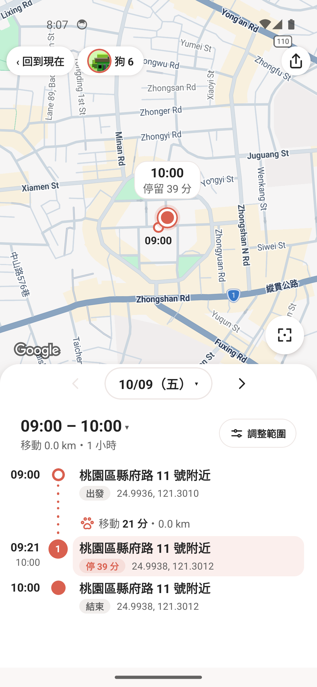

# PR 103: history header without warning count

- Screenshot: emulator-5562, existing `Codex_UI_09_Temporary`, Android 34, font scale 1.0, light theme; captured 2026-10-10 with the emulator console. Original 1080×2340 PNG, without compositing or editing.
- Installed release source: `d32280001d205d171d7e8c0b3e55a80fa6d4c8c4` (`dogtracker-phone-history-d322800.apk`). Host artifact and installed `base.apk` both SHA-256 `87a9fac19bef1a15fb2f9fb871688c0499d23090fb6b63e11ff6a6a2462d364f`.
- Header implementation: `58d2f388c015db8cf702d0f71803165acd2cffa5`. The release combines that change with the reviewed phone GPS preview; this screenshot is UI evidence, not GPS classification or performance acceptance.
- Data: the previously seeded, completely invented Taoyuan UI fixture (61 phone points, 61 dog-history points, dog 6), without a real account or translated personal CSV route. The visible address and coordinates belong to that fictitious fixture. No real account, token, identifier, or original location is present.
- Actual navigation: release launch → dog 6 → 看軌跡 → previous recorded day (10/09). The history header has no `⚠ N` badge, while the original arrow-up-tray export entry remains visible. The fixed half-height panel, date control, timeline and stop circle are visible.
- Installation preserved existing data. No new AVD, reset, wipe, debug bundle, or other emulator operation was used for this evidence. No crash/ANR dialogue was seen during this short navigation; this does not replace a long background or native-flow regression test.
