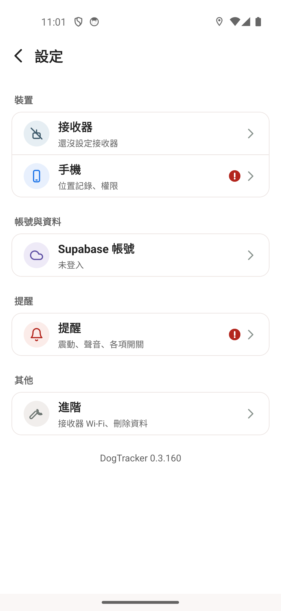

# 本機与 CI 的 0.3.commit數版本

本機先前使用 package.json 的 0.0.1，CI 才加 Git commit 數。現在共用 scripts/app-version.js，以 package.json 的 major.minor（0.3）加完整 HEAD commit 數；versionCode 同為此數。設定頁仍從原生 BuildConfig 取得版本，不是改顯示字串。

- 原生驗證來源 9b283eb3，HEAD 完整 commit 數 160；APK manifest versionName=0.3.160，versionCode=160，applicationId=com.dogtracker。
- 唯一 Android Release 建置成功；APK SHA da8933edffa1c6c7659df0f012a8c88d51d2edda8c7f9afc22c7dfc8e67922f0。
- Root 在既有 5558 install-r 成功，親自檢視設定頁原生截圖与 XML，DogTracker 0.3.160 可見。沒有清資料或更換帳號；下面兩圖均未登入，不含帳號、地理座標或軌跡。
- 來源完整 Jest 220 suites／2460 tests PASS，CI 範圍 lint 加 resolver 0 errors／9 既有 warnings；改動檔 lint 0／0。
- 真完整 Git、depth2 shallow clone、無 Git 的來源包與 CLI／GitHub-output 都已測試。完整歷史不可得時拒絕錯誤 count；成對 APP_VERSION_NAME／APP_VERSION_CODE override 保留。
- merge 及後續 commit 會自然增加版本尾碼；圖中的 160 是驗證當時的來源計數，不硬寫進產品。
- PR81 的正式簽章、applicationId 改名、R8、金鑰與上架流程沒有帶進此變更。

| 原本本機版本 | 修正後本機版本 |
|---|---|
|  |  |
