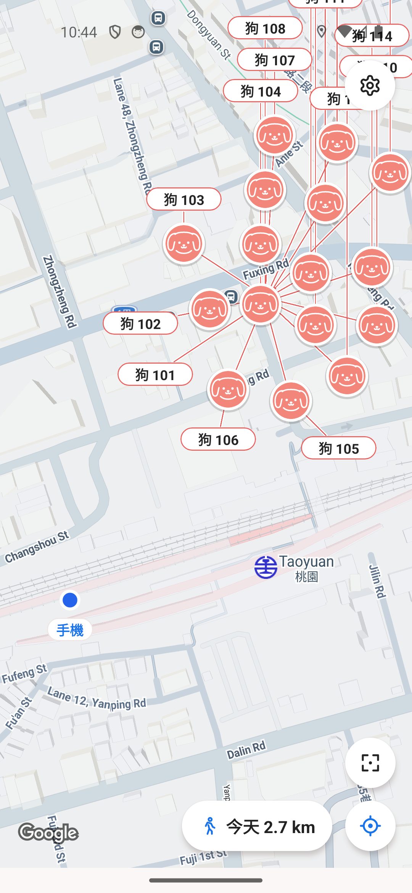
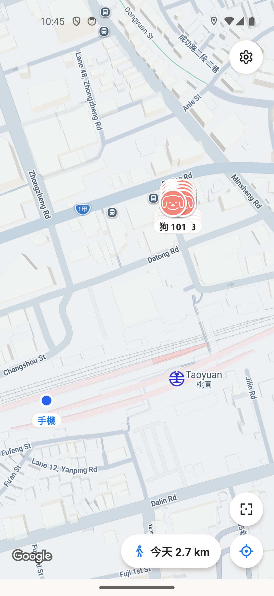
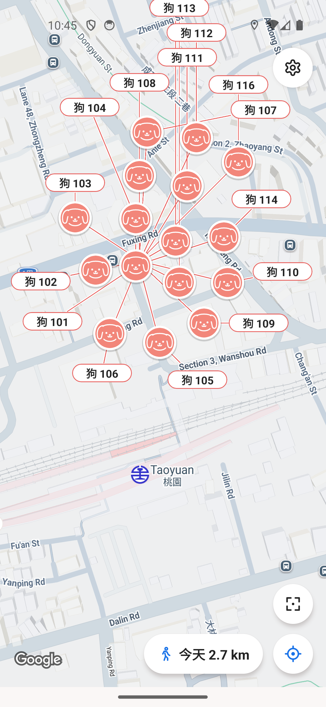
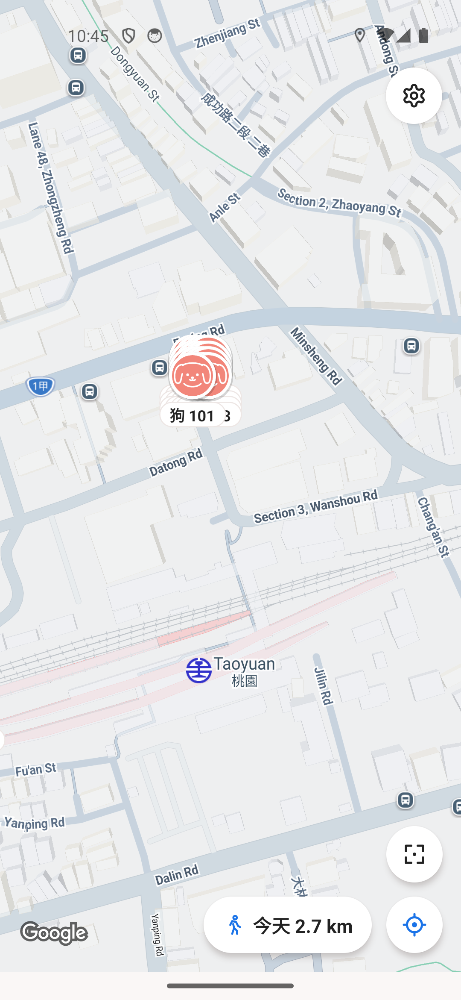
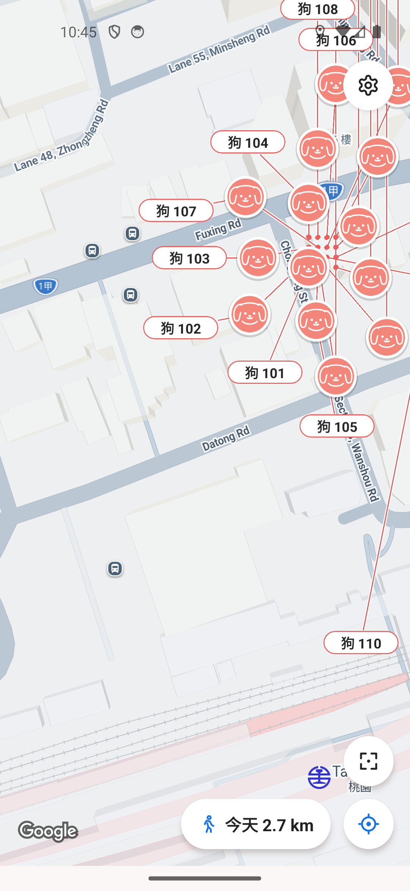
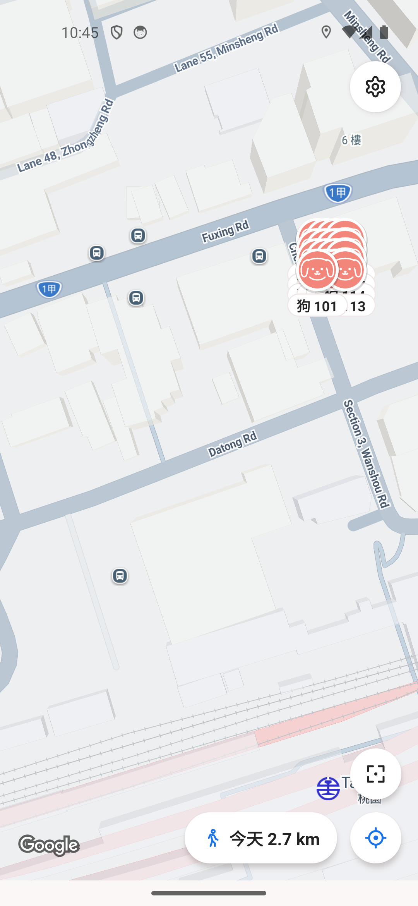
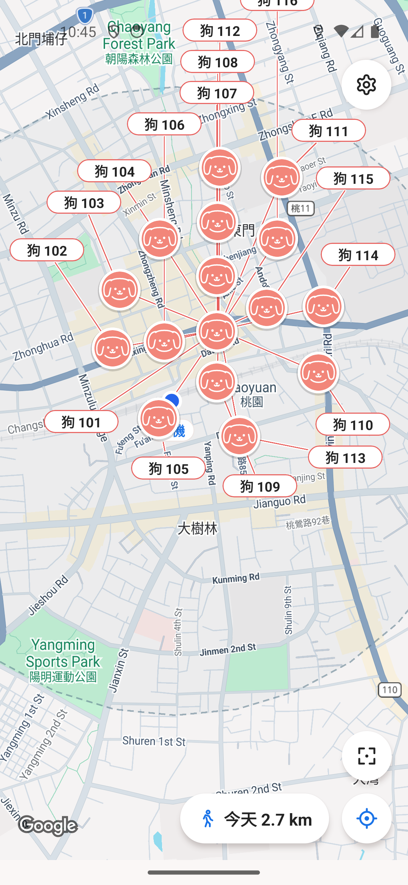
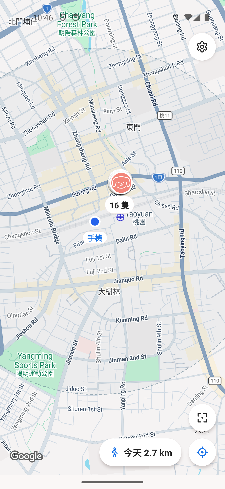
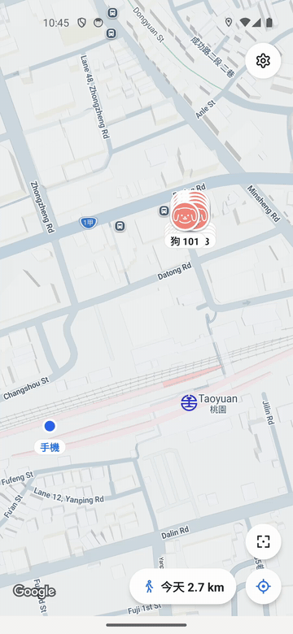

# 狗標籤回復：原生平移與縮放對照

此 PR 只撤回 PR104 的狗頭像移位及引線標籤，恢復頭像原座標與下方名字；不是整包 revert PR104。PhoneTracker、歷史路線及後續手勢修正保留。

## 測試資料與版本

- 5558，原生 Android Google Map；16 隻虛構狗（101–116）集中於 1.49 公尺對角線內。每隻 3 筆記錄，共 48 筆，由獨立公式產生，不使用使用者軌跡或雲端資料。
- 比較底版為 main `4dabce48` 加待核准 PR106 的既有正式測試整合版；前後均相同。私有測試入口與固定時間僅存在驗證 APK，沒有加入本 PR 的產品程式。
- Before 私有來源 `6e4606d1`／APK SHA `fc3cb751efa4c8702eb5b1fae0a73a088c7275f2f5ae2ddbb899374c450285f2`。
- After 私有來源 `fa902737`／APK SHA `0e27ff79c633650eda39eb679a314938bc97ad43d5766ccd1a3b48173d6dbe32`，套用本 PR 的 `2d5ca612`，僅保留 PR106 的平台比例處理。
- 實際操作依序為平移、反向平移、原生双指放大、縮小、再次縮小。MP4 為直接 screenrecord；GIF 為同影片的 6fps 預覽，截圖為直接 screencap。影片編碼時間約 17.8／17.6 秒，不用來比較效能。

## 親自檢視結果

Root 檢視兩支影片全部每秒兩格的檢閱圖，以及各操作的完整原生截圖：

- Before：狗的資料座標相近，頭像卻被排到街區不同位置；平移／縮放後重新排列，中心引線交錯，部分名字移出畫面。
- After：頭像維持資料座標，沒有引線與額外的排版位移。遠景恢復「16 隻」群組標籤。
- **尚有密集名字遮擋**：近景下方名字仍可重疊。本 PR 是回復可信的地圖位置，不宣稱已完成密集多狗的選取設計，也不是 GPS 精度測試。

## 自動檢查

- 完整 Jest：215 suites／2432 tests 全部通過。
- 完整 ESLint：0 errors／8 既有 warnings。
- 新回歸測試先於 main 出現反例，再於修正後通過：3 隻狗只產生 3 個原座標 marker；平移／縮放後沒有引線、額外 marker 或座標改寫，點選及無障礙仍對應原狗。
- 兩個私有原生驗證版本皆完成 Android Release 編譯及 install-r。拍攝後已還原正式整合 APK，不清資料或改帳號。

## 對照媒體

| 操作 | 帶線版 | 回復底部版 |
|---|---|---|
| 初始 |  |  |
| 平移後 |  |  |
| 放大後 |  |  |
| 再縮小 |  |  |

[Before 原始 MP4](before-pan-zoom.mp4) · [After 原始 MP4](after-pan-zoom.mp4)

**先讓使用者看過，獲准後才合併。**
